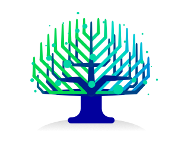

******

<h1 style="text-align: center;">apidag</h1>

A Python library using asyncio and aiohttp to build declarative API call flows. Designed for minimal repetition of definitions, modularity, and reusability, flowlib allows chaining of APIs, alongside formatting functions, in a directed acyclic graph. API definitions are defined as nodes of a graph, with their key elements (such as base URL, input and output parameters, and error handling) as attributes:

```python
# Define the APIs as nodes, with a glue function formatting one output into the next input
def xkcd_to_dictionary(outputs):
    title = outputs.get("title")[0]
    words = title.split()
    first_word = words[0].lower() if words else ""
    return {"word": first_word}
xkcd_node = apidag.APINode(
    id="xkcd_api",
    base_url="https://xkcd.com/{id}/info.0.json",
    input_params={"id": apidag.URLParam("id")},
    output_params={"title": "$.safe_title"},
    error_handlers={404: lambda: {"title": ["No title found"]}},
    linkage_function=xkcd_to_dictionary
)
dictionary_node = apidag.APINode(
    id="dictionary_api",
    base_url="https://api.dictionaryapi.dev/api/v2/entries/en/{word}",
    input_params={"word": apidag.URLParam("word")},
    output_params={"definition": "$..meanings[*].definitions[*].definition"},
    error_handlers={404: lambda: {"definition": ["No definition found"]}}
)
```

The connections between APIs are defined as edges of the graph:
```python
# Define edges
edge = apidag.Edge(source="xkcd_api", target="dictionary_api")

# Define the flow
flow = apidag.APIFlow(nodes=[xkcd_node, dictionary_node], edges=[edge])
```

Finally, with the flow defined, it's relatively straightforward to define a getter, the initial inputs, and a callback that does final processing once results are all gathered:
```python
# Define callback
def callback(results):
    comic_data = results.get("xkcd_api", {})
    dictionary_data = results.get("dictionary_api", {})
    comic_title = comic_data['output'].get('title', "Unknown Title")
    first_word = dictionary_data['input'].get('word', "Unknown Word")
    definitions = dictionary_data['output'].get('definition', [])
    if not isinstance(definitions, list):
        definitions = [definitions]

    if len(definitions) == 0:
        print(f"Comic #{comic_data['input']['id']} titled '{comic_title}' has its first word '{first_word}' undefined.")
    else:
        print(f"Comic #{comic_data['input']['id']} titled '{comic_title}' has its first word '{first_word}' defined as:")
        for definition in definitions:
            print("\t" + definition)

# Initialize the getter
getter = apidag.Getter(max_retries=3, workers=10)

# List of comic IDs to fetch in parallel
comic_ids = range(2630,2650)

# Define a main coroutine
async def main():
    tasks = [getter.run_flow(flow, {"id": str(comic_id)}, callback) for comic_id in comic_ids]
    await asyncio.gather(*tasks)

# Execute the main coroutine
asyncio.run(main())
```

This is all essentially identical to what's in the demo `.py` file, and note that there's no need for this flow to be linear! At runtime, the library builds the DAG of the nodes and will fail if there are any cyclic dependencies. When possible, it will try to do HTTP requests in parallel (note the `workers` argument to the getter) using `asyncio` and `aiohttp` for concurrency. This is still in its infancy and subject to change, but please let me know if this is compelling to you!
